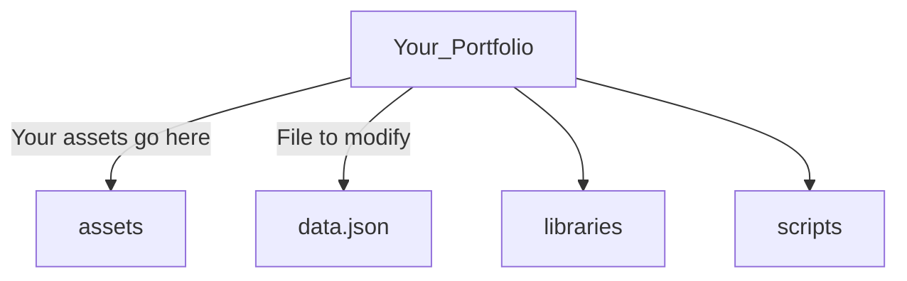

# Your_Portfolio

Use this template to create a portfolio of your own by modifying the `data.json` file.

# Folder Structure



`TIP`: Give each asset a descriptive name

# `data.json` Structure

`general`\
  |----`theme`: color names listed [here](https://tailwindcss.com/docs/customizing-colors) (lowercase)

`info`\
  |----`firstname`\
  |----`lastname`\
  |----`title`\
  |----`profileImagePath`: "`assets/`{profile image name}"\
  |----`resume`: "`assets/`{resume name}"\
  |----`description`

`connect`\
  |----`email`\
  |----`linkedin`\
  |----`youtube`\
  |----`facebook`\
  |----`github`\
  |----`instagram`\
  |----`codepen`

**NOTE**: Leave field `""` if you don't want to include it.

`projects`

**NOTE**: Leave field `[]` if you don't have any project else add the following structure for each project you want to showcase.

```json
{
  "id": 1,
  "name": "Title 1",
  "description": "Lorem ipsum dolor sit amet consectetur adipisicing elit. Libero aut fugit suscipit delectus culpa voluptatum iure fugiat.",
  "images": [
    {
      "imagePath": "assets/profile.jpg"
    },
    {
      "imagePath": "assets/profile.jpg"
    },
    {
      "imagePath": "assets/profile.jpg"
    }
  ],
  "model": "assets/chair.glb",
  "mainImage": "assets/profile.jpg"
}
```

**NOTE**:
- Each project `id` must be a unique number for navigation purpose.
- `images` can be left `[]` if you don't have any additional images for a project.
- `model` assets must be of type GLB / GLTF to work with the model viewer (If you use SolidWorks and need to convert from STL to GLB, use this [resource](https://myminifactory.github.io/stl2gltf/)).


`featured`\
  |----`enabled`: either `true` or `false` to show featured projects on homepage\
  |----`selected`: structure must be as follows if `enabled` is `true`\

  ```json
  [{ "id": 1 }, { "id": 2 }]
  ```
  `1` & `2` are example ids, you need to use the ones you defined for your projects above. If you are featuring any project, it is advised to feature between 2 to 4 projects.

---

`NOTE`: You can validate your JSON file using [this](https://jsonlint.com/) website.

To check your portfolio after editing `data.json` (don't forget to save any changes you make), open `index.html` with your browser. If you want to see any updates as you change `data.json`, just refresh your tab.

---

# Hosting

You can use [Netlify](https://www.netlify.com/) to host your new portfolio to make it public for anyone to see.

Instructions:
- Create an account on Netlify
- Click `Add new site`
- Select `Deploy manually`
- Drag & drop your portfolio website folder and voila, you portfolio should be live

---

### Todo:
- [ ] Add favicon field.